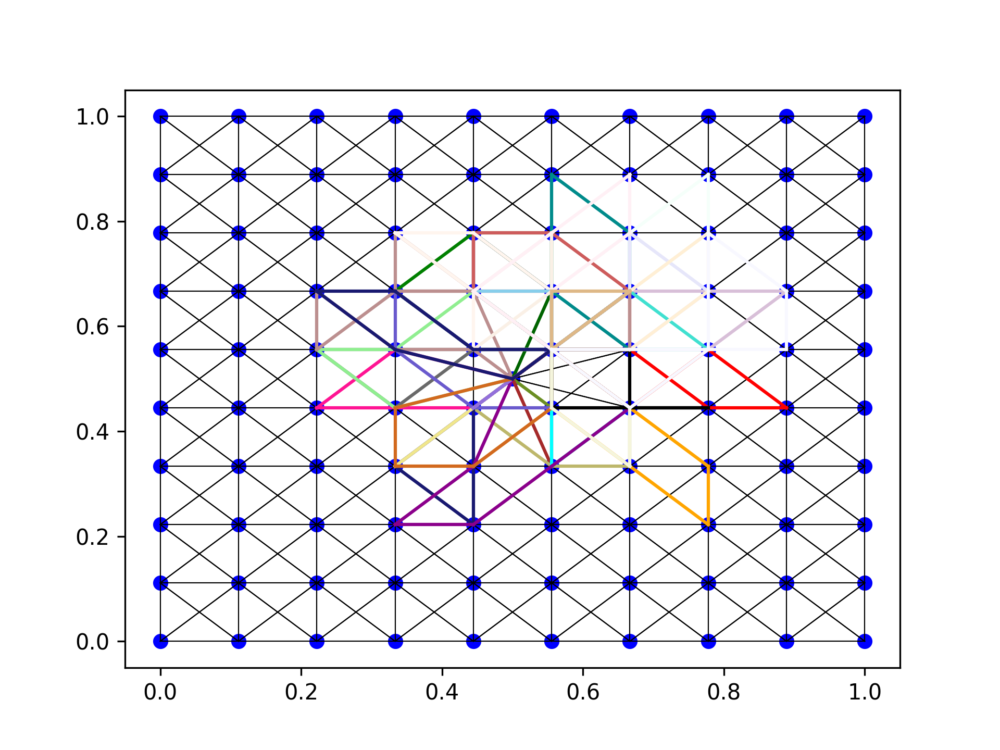

# The least traveled path
This idea originated from wandering around town.


How not always take the same way?
How to explore new areas?
See this blogpost:


## Generic prototype to discover unknown paths
In prototype.py, this idea is explored in a equidistant grid in the space 1x1.
The amount of points just makes it denser. We start at the middle.

The different paths are visible here: 

Some nodes get visited more often, which can be seen in this image:  

## OSMX based prototype
THis versions gets a real map.
It then searches possible paths.
This is in London: 

These are three possible paths: 

## Running it
```
 python3 osmx_based_ltp.py --latidue 51.5155211 --longitude -0.1321471 --location london
```